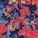
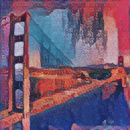
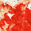
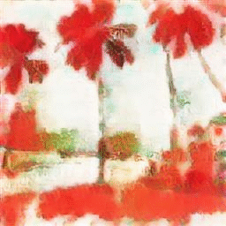
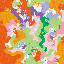
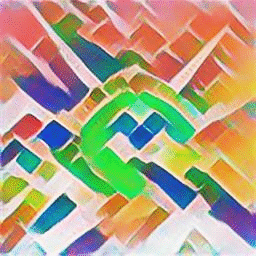
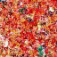
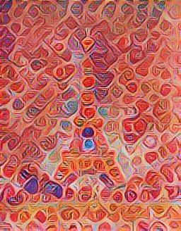

# Group Picasso
### Usage
* Download the 
[pre-trained model](https://storage.googleapis.com/download.magenta.tensorflow.org/models/arbitrary_style_transfer.tar.gz)
and extract the file(s) to this folder
* Run only this project and only once with ```python main.py -c group_picasso/test_config.json -p 1```

### Examples
Original content, style, markovified styles and generated artifacts:

















### Library references
* [markov-img-gen](https://github.com/JonnoFTW/markov-img-gen)
* [Fast Style Transfer for Arbitrary Styles](https://github.com/tensorflow/magenta/tree/master/magenta/models/arbitrary_image_stylization)
